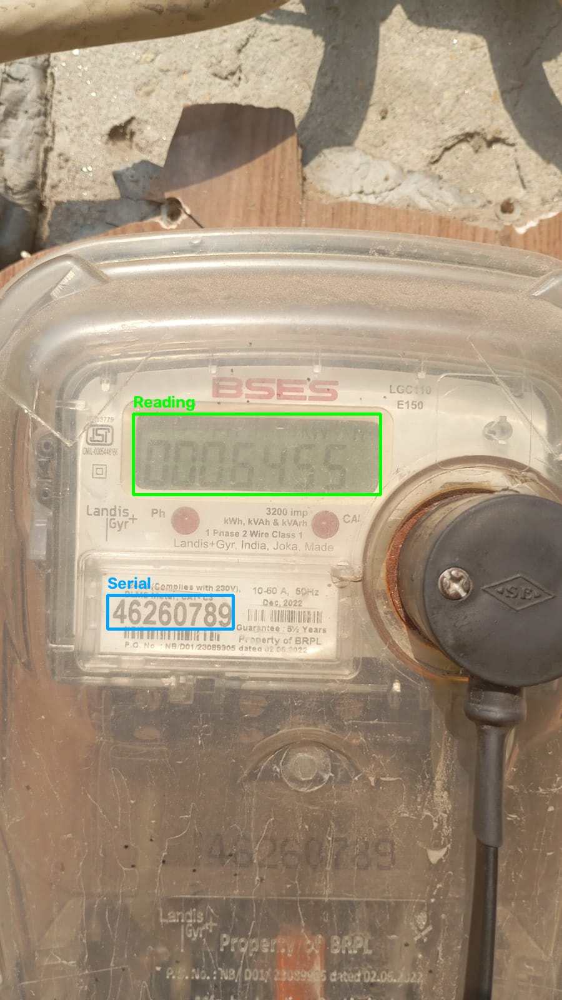

# Meter OCR

Automated pipeline for reading utility meters from photos. A YOLOv8 model
locates the **meter reading** and **serial number** regions on a meter
image, each region is cropped and preprocessed, and
[PaddleOCR](https://github.com/PaddlePaddle/PaddleOCR) extracts the text,
which is then parsed into a clean numeric reading and serial number.

## 📦 Resources

- **Dataset (327 labeled meter images):** [Kaggle Dataset — meter_data](https://www.kaggle.com/datasets/saarthaksrivastav/meter-data)
- **YOLOv8 training notebook (detector training + evaluation):** [Kaggle Notebook — meter_ocr](https://www.kaggle.com/code/saarthaksrivastav/meter-ocr)
- **Trained YOLO detector weights & run outputs:** [Notebook Output](https://www.kaggle.com/code/saarthaksrivastav/meter-ocr/output)

The dataset and trained detector weights are intentionally excluded
from this repository (see `.gitignore`) and hosted on Kaggle instead,
where the training run, logs, and evaluation output can be inspected
directly.

> **Note:** the Kaggle notebook covers only the YOLOv8 **detector**
> (localizing the reading and serial-number regions). PaddleOCR is used
> off-the-shelf for text recognition and is not fine-tuned or retrained
> as part of this project.

## How it works

1. **Detect** — a YOLOv8 model (`ultralytics`) finds two classes of
   bounding boxes on the input image:
   - `0` — `meter_reading`
   - `1` — `serial_number`
2. **Crop & preprocess** — each detected box is padded, converted to
   grayscale, contrast-boosted, and given a white border so PaddleOCR can
   read faded or edge-cut digits more reliably.
3. **Recognize** — PaddleOCR runs on each crop to produce raw text.
4. **Validate** — regex-based post-processing turns the raw OCR text into
   a clean `float` meter reading and a clean serial-number string (the
   engine prefers an 8-digit block, falling back to the longest digit
   run of 5+ characters).
5. **Output** — results (reading, serial number, raw OCR text, and
   detection confidences) are collected into a JSON file. Any image that
   fails is logged separately instead of aborting the whole batch.

## Project structure

```
Meter_Ocr/
├── .github/workflows/ci.yml        # Automated GitHub Actions testing pipeline
├── dataset.yaml                    # YOLO dataset config (classes, paths)
├── pyproject.toml                  # Project metadata & dependencies
├── docs/examples/                  # Sample annotated images & OCR crops
├── scripts/
│   └── visualize_results.py        # Generates annotated + cropped examples
├── tests/
│   ├── test_ocr_engine.py          # Unit tests for OCR text validation
│   └── test_pipeline.py            # Mocked integration tests for the pipeline
└── src/meter_reader/
    ├── __init__.py
    ├── split_data.py                # Train/val split for the labeled dataset
    ├── auto-labelling.py            # Semi-automated labeling with a draft model
    ├── train.py                     # YOLOv8 training script
    ├── ocr_engine.py                # PaddleOCR wrapper + text validation
    └── pipeline.py                  # End-to-end detect -> crop -> OCR pipeline
```

## Requirements

- Python 3.10
- Core dependencies (from `pyproject.toml`):
  - `ultralytics` (YOLOv8)
  - `paddleocr` + `paddlepaddle`
  - `opencv-python`
  - `label-studio` (for manual annotation)
- Dev dependency: `pytest` (declared under `[dependency-groups]`)

### Install with `uv` (recommended)

```bash
uv sync
```

### Install with `pip`

```bash
pip install -e .
```

## Dataset preparation

The pipeline expects a YOLO-format dataset described by `dataset.yaml`:

```yaml
path: ./dataset/processed
train: images/train
val: images/val
names:
  0: meter_reading
  1: serial_number
```

The raw, labeled dataset is published on Kaggle:
[meter_data](https://www.kaggle.com/datasets/saarthaksrivastav/meter-data).
Download it and place it under `dataset/` to reproduce the split and
training steps below.

The dataset (327 images) was built using an AI-assisted labeling
workflow:

1. **Manually annotate a seed set** — ~50 images were labeled by hand in
   [Label Studio](https://labelstud.io/) and exported in YOLO format into
   `dataset/images/` and `dataset/labels/`.
2. **Train a draft model** on just that seed set (via `train.py`,
   pointed at the small labeled subset) to get a rough detector.
3. **Auto-label the rest of the dataset** with the draft model. This
   skips any image that already has a label file, so the manually
   labeled seed images are never overwritten:

   ```bash
   python src/meter_reader/auto-labelling.py \
       --draft-model runs/detect/meter_detector-2/weights/best.pt \
       --images-dir dataset/images \
       --labels-dir dataset/labels \
       --conf 0.5
   ```

4. **Review and correct in Label Studio** — the auto-generated labels
   were re-imported into Label Studio and manually reviewed/corrected
   for accuracy.
5. **Discard the draft model** — once the full dataset was labeled and
   corrected, the draft model was deleted; it was only a labeling aid,
   not the production model.
6. **Split into train/val sets** (80/20 by default, seeded for
   reproducibility):

   ```bash
   python src/meter_reader/split_data.py
   ```

   This reads from `dataset/` and writes the split into
   `dataset/processed/{images,labels}/{train,val}`, matching the layout
   `dataset.yaml` expects.

## Training

`train.py` trains a YOLOv8n detector and is used twice in this project's
workflow: once on the small hand-labeled seed set to produce the
temporary **draft model** used for auto-labeling, and once on the
**full, reviewed dataset** to produce the final production model. All
key parameters are configurable via CLI flags:

```bash
python src/meter_reader/train.py \
    --model yolov8n.pt \
    --data dataset.yaml \
    --epochs 120 \
    --batch 16 \
    --patience 25 \
    --name meter_detector_prod
```

Training runs on CPU by default and saves the best weights to:

```
runs/detect/meter_detector_prod/weights/best.pt
```

## Running the pipeline

Once you have trained weights, run the full detect → crop → OCR pipeline
on a directory of images:

```bash
python src/meter_reader/pipeline.py \
    --model models/best.pt \
    --input-dir dataset/processed/images/val \
    --output batch_results.json \
    --failures failures.json
```

Successful results are written to `batch_results.json`; any image that
fails to process is logged with its error message to `failures.json`
instead of stopping the batch.

To use `MeterPipeline` on a single image programmatically:

```python
from src.meter_reader.pipeline import MeterPipeline

pipeline = MeterPipeline(yolo_model_path="models/best.pt")
result = pipeline.process_image("path/to/image.jpg")
print(result)
```

## 📊 Model Evaluation & Metrics

### Dataset

The pipeline was trained and evaluated on a custom dataset of **327
images** of electric meters. The initial dataset was auto-labeled using
a draft model, followed by manual review, bounding-box correction, and
augmentation to ensure high-quality ground truth data.

### 1. YOLO object detection performance

The model was trained on Kaggle accelerators to accurately localize the
meter display and the serial number panel. Evaluation on the validation
set yielded:

| Metric | Value |
|---|---|
| mAP@50 | 89.9% |
| mAP@50-95 | 71.2% |
| Average inference confidence | > 85% across diverse real-world conditions |

*Full YOLO detector training run, logs, and evaluation output are
available in the
[Kaggle notebook](https://www.kaggle.com/code/saarthaksrivastav/meter-ocr).
(This covers detection only — see the note above on OCR scope.)*

### 2. End-to-end OCR success rate

The full pipeline (YOLO crop → OpenCV preprocessing → PaddleOCR → regex
validation) was run against a heavily distorted validation batch of 64
real-world images:

| Field | Extraction rate |
|---|---|
| Serial number | ~54% (35/64) |
| Meter reading | ~34% (22/64) |

**Engineering note on OCR metrics:** the dataset contains extreme
real-world noise. The "missed" extractions largely reflect physical
hardware limitations in the source images — LED glare washing out the
LCD screen, scratched plastic covers, and dirt/grime obscuring the
digits — rather than pipeline failures. When the text is physically
visible in the image, extraction success approaches 100%.

## 📸 Visual examples

The pipeline filters out surrounding label noise (barcodes,
manufacturer text) and returns strictly typed data. Below is a
successful detection on a heavily worn meter — note the correctly
localized reading and serial number regions despite grime, glare, and a
cracked cover:



```json
{
    "meter_reading": 6455.0,
    "raw_meter_reading": "0006455",
    "serial_number": "46260789",
    "raw_serial_number": "ULMa Meter. CAT-C3 46260789",
    "detections": {
        "meter_reading_conf": 0.9333,
        "serial_number_conf": 0.8232
    },
    "filename": "000103049033.jpg"
}
```

Additional annotated images and cropped OCR inputs (including a known
glare-failure case) are in `docs/examples/`. Regenerate them for new
images with:

```bash
python scripts/visualize_results.py \
    --model models/best.pt \
    --images path/to/image1.jpg path/to/image2.jpg \
    --out-dir docs/examples
```

## Testing

Unit tests cover the OCR text-validation logic (`ocr_engine.py`), and
mocked integration tests cover the pipeline's detection and error-
handling paths without requiring real model weights or a PaddleOCR
download:

```bash
pytest
```

## Status 

- `auto-labelling.py` references the draft model's path by default
  (`runs/detect/meter_detector-2/weights/best.pt`); since the draft
  model is deleted after labeling is complete, this script is only
  needed again if you extend the dataset with new unlabeled images.
- `pipeline.py` loads the final production model from `models/best.pt`
  by default — override with `--model` to point at your own trained
  weights.


## License

This project is licensed under the **GNU Affero General Public License v3.0 (AGPL-3.0)** to maintain compatibility with Ultralytics YOLOv8. See the [LICENSE](LICENSE) file for details.